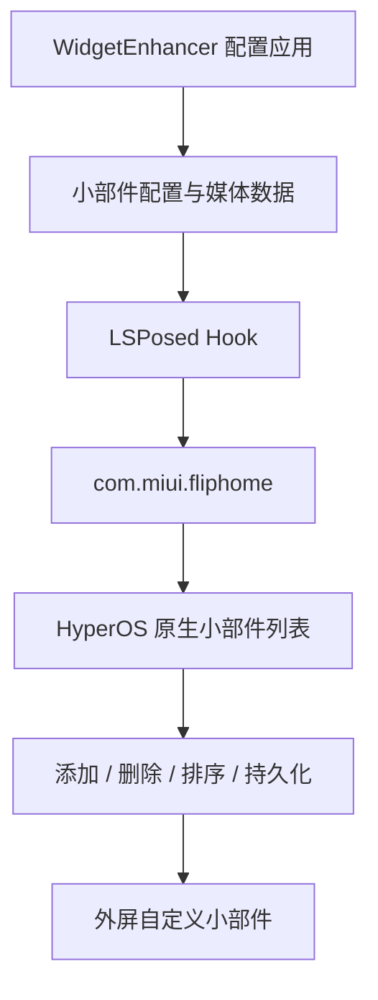

<div align="center">

# WidgetEnhancer

为 **Xiaomi MIX Flip 外屏**提供自定义小部件能力的 LSPosed 模块

[](https://github.com/luckylca/WidgetEnhancer/releases/latest)
[](LICENSE)
[](https://github.com/LSPosed/LSPosed)

</div>

WidgetEnhancer 将自定义小部件直接接入 HyperOS 原生外屏小部件系统。创建后的小部件会出现在系统的「外屏 → 小部件 → 自定义」中，可以像官方小部件一样添加、删除、排序和使用。

> [!IMPORTANT]
> 本模块面向 **Xiaomi MIX Flip**，需要 Root、LSPosed 和 HyperOS 外屏桌面 `com.miui.fliphome`。

## 功能

### 媒体小部件

在外屏展示图片或循环视频。

- 支持图片和视频
- 支持裁剪、缩放和位置调整
- 按照外屏比例生成预览
- 视频支持循环播放

### 音乐小部件

显示当前正在播放的音乐，并提供歌词和媒体控制。

- 歌曲名称与歌手
- 专辑封面
- 当前歌词与下一句歌词
- 播放状态
- MediaSession 媒体控制
- 网易云音乐同步歌词适配

| 操作 | 功能 |
| --- | --- |
| 单击 | 播放 / 暂停 |
| 双击上半区域 | 上一首 |
| 双击下半区域 | 下一首 |
| 长按上半区域 | 增加音量 |
| 长按下半区域 | 降低音量 |

### 快捷按钮小部件

可以创建包含 **1～6 个按钮**的快捷小部件，按钮数量会自动匹配对应布局。

支持绑定应用以及常用系统操作，包括：

- 打开应用
- 音量控制与静音
- 手电筒
- 勿扰模式
- 自动旋转
- 锁屏
- 播放 / 暂停
- 上一首 / 下一首
- 部分快捷设置功能

### 小部件管理

模块自带配置应用，可以直接管理外屏小部件：

- 创建、编辑和删除
- 重命名
- 启用 / 禁用
- 实时预览
- 导入小部件

创建完成后，进入：

```text
设置 → 外屏 → 小部件 → 自定义
```

即可将其添加到外屏。

## 实现原理

WidgetEnhancer 基于 **LSPosed / Xposed Hook** 实现，主要作用于 Xiaomi MIX Flip 的外屏桌面进程：

```text
com.miui.fliphome
```

模块将自定义小部件信息注入 HyperOS 原有的小部件列表，并复用系统已有的小部件管理和页面机制。



因此，小部件的添加、删除、排序、页面管理和持久化会尽可能继续使用 HyperOS 原有逻辑，模块主要负责自定义小部件的数据、配置与显示内容。

## 兼容性

当前主要适配 **Xiaomi MIX Flip（ruyi）+ HyperOS**。

由于不同 HyperOS 版本的内部实现可能存在差异，系统 OTA 后可能需要更新模块才能继续正常使用。

## LSPosed 作用域

### 必选

```text
com.miui.fliphome
```

这是模块的主要 Hook 目标。

### 可选：网易云音乐

```text
com.netease.cloudmusic
```

用于获取更完整的网易云音乐同步歌词数据。

### 可选：SystemUI

```text
com.android.systemui
```

用于部分高级快捷设置功能。不使用相关功能时无需勾选。

## 安装

1. 从 [Releases](https://github.com/luckylca/WidgetEnhancer/releases/latest) 下载并安装 APK。
2. 在 LSPosed 中启用 WidgetEnhancer。
3. 至少勾选 `com.miui.fliphome` 作用域。
4. 根据需要勾选网易云音乐或 SystemUI。
5. 重启手机。
6. 打开 WidgetEnhancer 创建小部件。
7. 进入「设置 → 外屏 → 小部件 → 自定义」添加小部件。

## 权限

部分功能需要额外系统权限：

| 权限 | 用途 |
| --- | --- |
| 通知使用权 | 获取媒体播放状态和音乐信息 |
| 相机权限 | 控制手电筒 |
| 勿扰模式访问权限 | 控制勿扰模式 |
| 修改系统设置 | 控制自动旋转等系统功能 |

不使用对应功能时无需授予相关权限。

## 构建

```bash
git clone https://github.com/luckylca/WidgetEnhancer.git
cd WidgetEnhancer
./gradlew assembleRelease
```

构建产物位于：

```text
app/build/outputs/apk/release/
```

## 开源协议

WidgetEnhancer 使用 **GNU General Public License v3.0（GPL-3.0）** 开源。

你可以在 GPL-3.0 条款下使用、修改和分发本项目。分发修改版本时，需要遵守 GPL-3.0 对源代码公开及许可证保留等要求。

完整协议请参阅 [LICENSE](LICENSE)。
